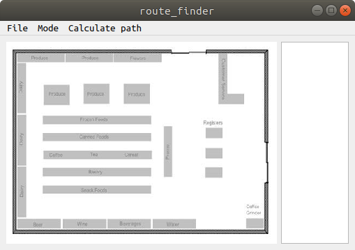
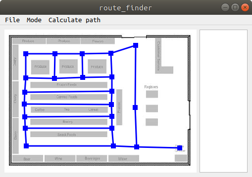
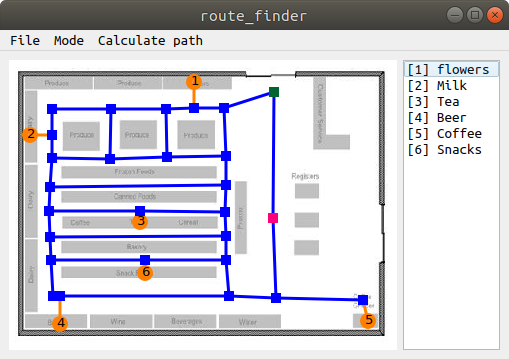
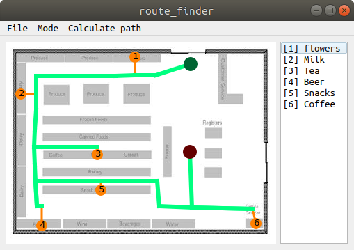

# Route/path planner

Find shortest route between targets. Draw your own route/targets on image.

* mouse left click adds route-node
* mouse right click opens context menu
* double-click to connect nodes

### Load image

### Draw all possible routes 

### Add start/end nodes and targets

### Calculate shortest path

